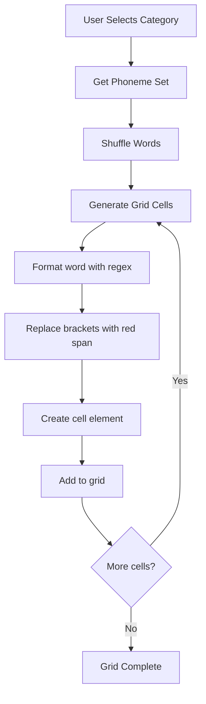

# Phoneme Implementation Plan (Revised)

## Overview
Transform the Word Grid Game into a phonics learning tool with all English phonemes organized by category, using a simple bracket notation for highlighting.

## Highlighting System
Use bracket notation to mark phonemes for red highlighting:
- `"[gr]een"` → <span style="color:red">gr</span>een
- `"m[ee]t"` → m<span style="color:red">ee</span>t
- `"[ch]in"` → <span style="color:red">ch</span>in
- `"h[ou]se"` → h<span style="color:red">ou</span>se

### Simple Parser Function
```javascript
function formatWord(word) {
    // Replace [text] with <span style="color:red">text</span>
    return word.replace(/\[([^\]]+)\]/g, '<span style="color:red">$1</span>');
}
```

## Phoneme Categories and Words

### 1. Short Vowels
Highlight the short vowel in each word.

**Words:**
```
c[a]t, b[e]d, p[i]g, h[o]t, b[u]s
m[a]p, t[e]n, s[i]t, d[o]g, c[u]p
h[a]t, p[e]n, b[i]g, l[o]g, n[u]t
r[a]n, g[e]t, f[i]x, t[o]p, c[u]t
s[a]d, l[e]t, w[i]n, h[o]p, s[u]n
```

### 2. Long A
Highlight the long A spelling.

**Words:**
```
c[a]ke, r[ai]n, d[ay], [ei]ght, w[ei]gh
m[a]ke, tr[ai]n, pl[ay], v[ei]n, sl[ei]gh
n[a]me, p[ai]n, s[ay], th[ey], n[ei]gh
f[a]ce, w[ai]t, p[ay], gr[ey], h[ei]ght
```

### 3. Long E
Highlight the long E spelling.

**Words:**
```
f[ee]t, m[ea]t, f[ie]ld, c[ei]ling, happ[y], k[ey]
s[ee], s[ea], p[ie]ce, rec[ei]ve, bab[y], mon[ey]
tr[ee], b[ea]d, ch[ie]f, br[ie]f, ver[y], hon[ey]
gr[ee]n, l[ea]f, sh[ie]ld, dec[ei]t, funn[y], mon[ey]
sl[ee]p, t[ea], f[ie]ld, c[ei]ling, funn[y], k[ey]
```

### 4. Long I
Highlight the long I spelling.

**Words:**
```
b[i]ke, n[igh]t, fl[y], p[ie]
l[i]ke, l[igh]t, cr[y], t[ie]
t[i]me, h[igh], sk[y], d[ie]
f[i]ve, r[igh]t, tr[y], l[ie]
n[i]ne, f[igh]t, dr[y], t[ie]
```

### 5. Long O
Highlight the long O spelling.

**Words:**
```
h[o]me, b[oa]t, sn[ow], t[oe]
b[o]ne, c[oa]t, gr[ow], h[oe]
r[o]se, r[oa]d, sh[ow], w[oe]
n[o]te, g[oa]t, sl[ow], f[oe]
h[o]pe, l[oa]d, kn[ow], t[oe]
```

### 6. Long U
Highlight the long U spelling.

**Words:**
```
c[u]be, f[ew], bl[ue], m[oo]n
t[u]be, n[ew], gl[ue], s[oo]n
m[u]le, d[ew], tr[ue], sp[oo]n
c[u]te, kn[ew], cl[ue], b[oo]t
r[u]le, gr[ew], q[ue]ue, f[oo]d
```

### 7. R-Controlled Vowels
Highlight the r-controlled vowel.

**Words:**
```
c[ar], h[er], b[ir]d, c[or]n, t[ur]n
f[ar], t[er]m, g[ir]l, f[or]k, b[ur]n
st[ar], f[er]n, st[ir], p[or]t, s[ur]f
p[ar]k, v[er]b, f[ir]st, b[or]n, h[ur]t
d[ar]k, ov[er], sh[ir]t, sh[or]t, c[ur]ve
```

### 8. Diphthongs
Highlight the diphthong.

**Words:**
```
h[ou]se, c[ow], c[oi]n, b[oy], [au]to, s[aw], b[oo]k
[ou]t, n[ow], j[oi]n, t[oy], [au]gust, l[aw], l[oo]k
l[ou]d, t[own], p[oi]nt, en[joy], c[au]se, dr[aw], g[oo]d
s[ou]nd, d[own], [oi]l, destr[oy], l[au]nch, str[aw], st[oo]l
r[ou]nd, br[ow], s[oi]l, empl[oy], f[au]lt, cr[aw]l, t[oo]k
```

### 9. Consonant Digraphs
Highlight the digraph.

**Words:**
```
[ch]in, [sh]ip, [th]at, [th]in, [wh]en, [ph]one, [ng]
[ch]at, [sh]op, [th]is, b[th]ath, [wh]ere, [ph]oto, si[ng]
[ch]ip, f[sh]ish, [th]em, p[th]ath, [wh]ite, gra[ph], so[ng]
[ch]eck, [sh]ell, [th]en, t[th]ooth, [wh]eat, para[ph], ki[ng]
[ch]est, [sh]ell, [th]ose, m[th]outh, [wh]ale, ele[ph]ant, ri[ng]
```

### 10. Beginning Blends
Highlight the blend.

**Words:**
```
[bl]ack, [br]own, [cl]ap, [cr]y, [dr]um, [fl]ag, [fr]og
[gl]ad, [gr]een, [pl]an, [pr]ay, [sc]an, [sk]in, [sl]ip
[sm]all, [sn]ap, [sp]in, [st]op, [sw]im, [tr]ee, [tw]in
[bl]ue, [br]ead, [cl]ip, [cr]ab, [dr]op, [fl]at, [fr]ee
[gl]ass, [gr]ape, [pl]ay, [pr]ess, [sc]hool, [sk]y, [sl]ow
```

### 11. Ending Blends
Highlight the blend.

**Words:**
```
ha[nd], te[nt], fa[st], a[sk], cla[sp], le[ft], co[ld]
wa[lk], he[lp], be[lt], ju[mp], ba[nk], ki[ng], a[ct], ke[pt]
sa[nd], mi[nt], li[st], ta[sk], gra[sp], so[ft], ho[ld]
ta[lk], ke[lp], sa[lt], la[mp], dri[nk], ri[ng], fa[ct], sle[pt]
ba[nd], pri[nt], bu[st], ri[sk], cla[sp], gi[ft], fo[ld]
```

## Implementation Summary

### Data Structure (Simplified)
```javascript
const phonemeSets = {
    shortVowels: [
        "c[a]t", "b[e]d", "p[i]g", "h[o]t", "b[u]s",
        // ... more words
    ],
    longA: [
        "c[a]ke", "r[ai]n", "d[ay]", "[ei]ght", "w[ei]gh",
        // ... more words
    ],
    longE: [
        "f[ee]t", "m[ea]t", "f[ie]ld", "c[ei]ling", "happ[y]", "k[ey]",
        // ... more words
    ],
    // ... other categories
};
```

### Format Function
```javascript
function formatWord(word) {
    return word.replace(/\[([^\]]+)\]/g, '<span style="color:red">$1</span>');
}
```

### Dropdown Options
- Short Vowels
- Long A
- Long E
- Long I
- Long O
- Long U
- R-Controlled Vowels
- Diphthongs
- Consonant Digraphs
- Beginning Blends
- Ending Blends

## Mermaid Diagram: Simplified Data Flow



## Advantages of Bracket Notation
1. **Simpler data structure** - Just strings, no objects
2. **Easy to read** - Phoneme is visually marked in the source
3. **Easy to edit** - Just move brackets to change highlight
4. **Less code** - Single regex replace function
5. **Flexible** - Works for any phoneme length
